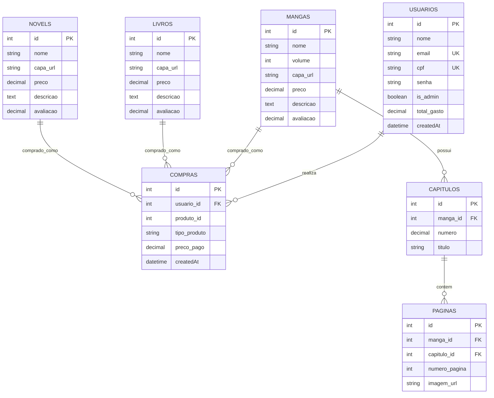
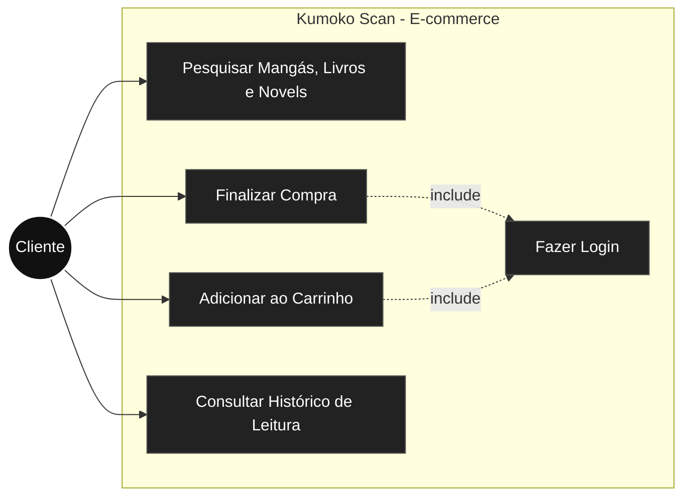
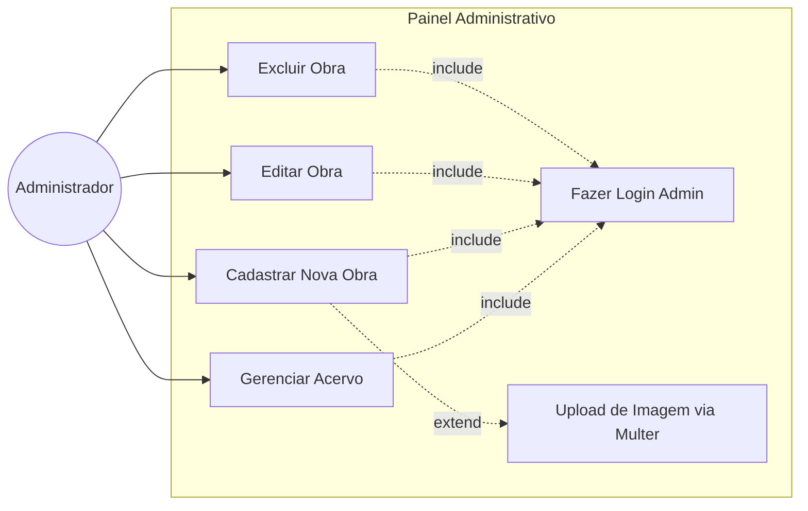
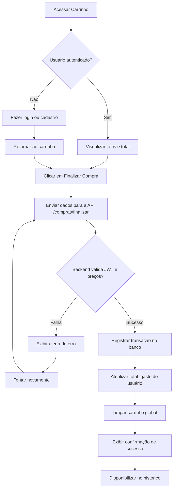
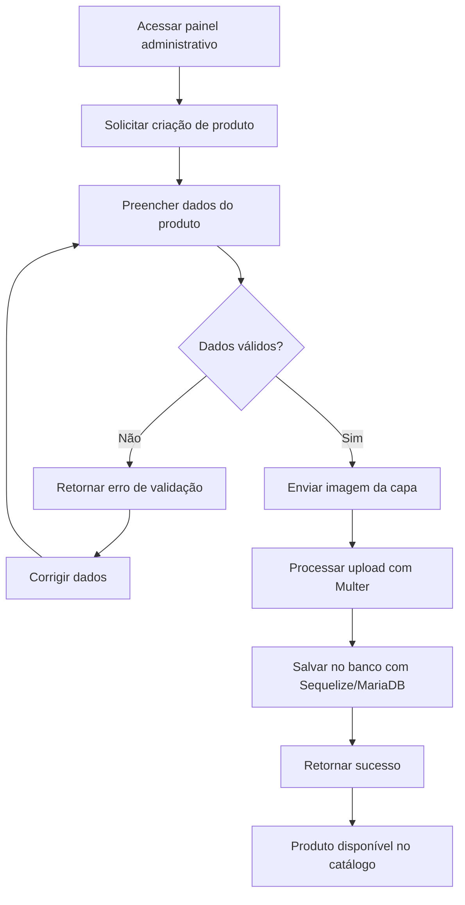
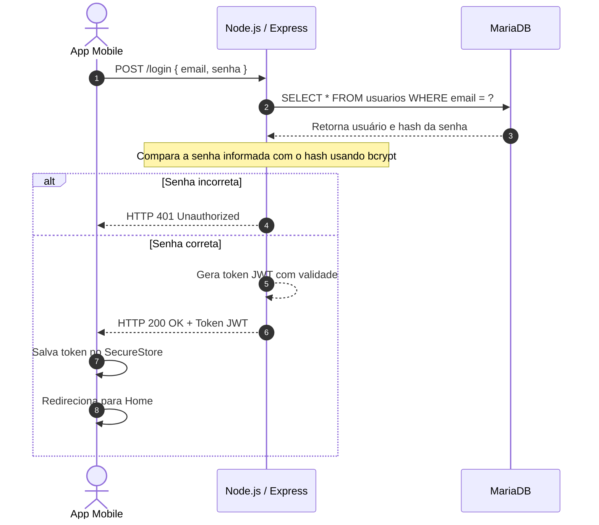
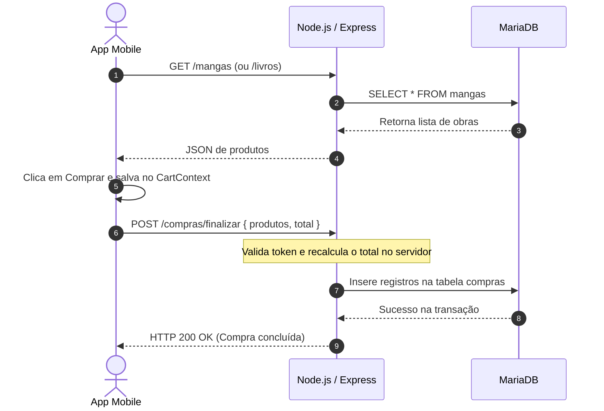

# Kumoko Scan - E-commerce e Acervo de Obras

## Contextualização do Problema e Evolução do Produto

O projeto consiste no desenvolvimento de uma plataforma de comércio eletrônico voltada para a comercialização e leitura de mangás, livros e light novels.

A necessidade do sistema surgiu a partir da dificuldade de centralizar o acervo de publicações independentes e traduções. Inicialmente, o público e os leitores entravam em contato de forma descentralizada para verificar disponibilidade de volumes, lançamentos e informações sobre capítulos. Esse modelo gerava um atendimento manual, pouco escalável e com baixa organização.

Diante desse problema, o produto foi evoluindo ao longo do tempo para atender melhor às demandas do público e da operação do negócio.

### Primeira versão - Catálogo online
A primeira versão teve como objetivo principal disponibilizar o acervo de obras na internet, reduzindo a necessidade de contato direto para consultas simples. Foi desenvolvido um site que apresentava as obras disponíveis e suas capas, permitindo que o leitor consultasse previamente o catálogo.

No entanto, essa etapa ainda não oferecia um processo de compra integrado. Quando o usuário se interessava por uma obra, o fluxo dependia de contato externo para concluir a transação manualmente.

### Segunda versão - Implementação do e-commerce
A segunda versão surgiu para transformar o catálogo em uma plataforma de comércio eletrônico completa, permitindo que o cliente realizasse compras diretamente pelo sistema.

Nessa etapa, foi criada uma área administrativa, conhecida como "Painel do Administrador" ou "Mestre das Sombras", responsável por gerenciar todo o acervo. Foram implementadas funcionalidades essenciais para os clientes, como:

- Cadastro de usuários com validação de CPF e e-mail;
- Login e autenticação segura baseada em JWT;
- Gerenciamento de conta;
- Carrinho de compras global;
- Seleção de produtos e finalização de pedidos;
- Histórico de compras integrado ao banco de dados.

### Terceira versão - Expansão para dispositivos móveis
Na terceira versão, o objetivo foi ampliar o acesso à plataforma por meio de um aplicativo móvel desenvolvido com React Native e Expo. Isso permitiu que leitores navegassem pelo catálogo e realizassem compras diretamente pelo celular, com uma experiência nativa e responsiva.

---

## Arquitetura e Diagramas do Sistema

### 1. Diagrama Entidade-Relacionamento (DER)

### 2. Diagramas de Casos de Uso

#### Processo de Compra pelo Cliente

#### Gestão de Produtos pelo Administrador

### 3. Diagramas de Atividades

#### Processamento de Compra (Checkout)

#### Fluxo de Cadastro de Produto pelo Administrador

### 4. Diagramas de Sequência

#### Autenticação de Usuário (Login)

#### Adição ao Carrinho e Busca de Produtos

## Requisitos Funcionais

1. Autenticação e Usuários

- RF01: O sistema deve permitir o cadastro de novos usuários com nome, e-mail, CPF e senha, garantindo que e-mail e CPF sejam únicos.
- RF02: O sistema deve permitir login com e-mail e senha, gerando um token JWT.
- RF03: O sistema deve permitir logout do usuário, removendo o token armazenado de forma segura.
- RF04: O sistema deve suportar perfis de acesso distintos, como Cliente e Administrador.
- RF05: O sistema deve restringir o acesso a rotas administrativas por meio de middleware de autenticação e verificação de privilégios.

2. Produtos (Mangás, Livros e Novels)

- RF06: O sistema deve permitir o cadastro de produtos com nome, volume, preço, descrição, avaliação e capa.
- RF07: O sistema deve permitir a edição de produtos existentes.
- RF08: O sistema deve permitir a exclusão de produtos e a remoção física dos arquivos associados no servidor.
- RF09: O sistema deve permitir a listagem de produtos.
- RF10: O sistema deve permitir o envio de imagens no cadastro e edição de produtos por meio do Multer.

3. Carrinho de Compras

- RF11: O sistema deve permitir adicionar produtos ao carrinho global na memória do aplicativo, por meio do CartContext.
- RF12: O sistema deve permitir alterar a quantidade de itens no carrinho.
- RF13: O sistema deve permitir remover itens do carrinho.
- RF14: O sistema deve calcular o valor total do carrinho automaticamente.

4. Compras e Histórico

- RF15: O sistema deve permitir a finalização de um pedido a partir dos itens do carrinho autenticado.
- RF16: O sistema deve recalcular os preços no servidor de forma segura, ignorando adulterações diretas no cliente.
- RF17: O sistema deve registrar as transações na tabela de compras e atualizar o total gasto pelo usuário.
- RF18: O sistema deve permitir a consulta do histórico de compras do usuário autenticado.

5. Painel Administrativo

- RF19: O sistema deve fornecer rotas protegidas exclusivas para administradores gerenciarem o acervo.

## Requisitos Não Funcionais

1. Segurança

- RNF01: O sistema deve armazenar senhas de forma criptografada utilizando hash com a biblioteca bcrypt.
- RNF02: O sistema deve utilizar autenticação baseada em token JWT.
- RNF03: O sistema deve validar e autorizar rotas sensíveis por meio de middlewares de segurança.
- RNF04: O sistema deve limitar o tamanho e os tipos de arquivos permitidos no upload de imagens via Multer, com máximo de 5MB e extensões válidas.

2. Manutenibilidade e Arquitetura

- RNF05: O código do backend deve ser escrito em TypeScript, utilizando tipagem estática.
- RNF06: O backend deve seguir uma arquitetura em camadas bem definidas, com controllers, models, routes e config.
- RNF07: O sistema deve utilizar o Sequelize ORM para padronizar o acesso ao banco de dados relacional MariaDB.
- RNF08: O sistema deve possuir testes automatizados de ponta a ponta (E2E) estruturados com Jest e Supertest.

3. Compatibilidade e Tecnologias

- RNF09: O frontend mobile deve ser construído com React Native e Expo, garantindo compatibilidade com Android.
- RNF10: O backend deve ser desenvolvido em Node.js com Express, atuando como uma API RESTful independente.
- RNF11: O banco de dados deve utilizar MariaDB para persistência estruturada das informações.

---

## Visão Geral do Projeto

O Kumoko Scan foi pensado como uma plataforma completa para a gestão e comercialização de obras digitais e físicas dentro de um ecossistema de leitura e acervo. A solução une catálogo, autenticação, carrinho, compras e painel administrativo em uma estrutura que atende tanto ao cliente quanto ao administrador.

A proposta do projeto vai além de um simples e-commerce: ela oferece uma experiência de leitura e organização do acervo, com foco em mangás, livros e novels, e integra diferentes camadas do sistema em uma arquitetura moderna e escalável.

